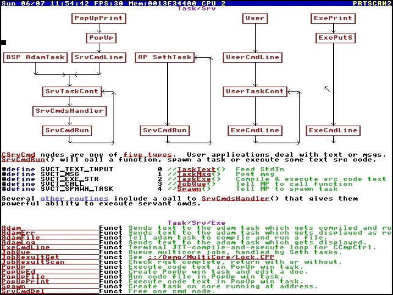
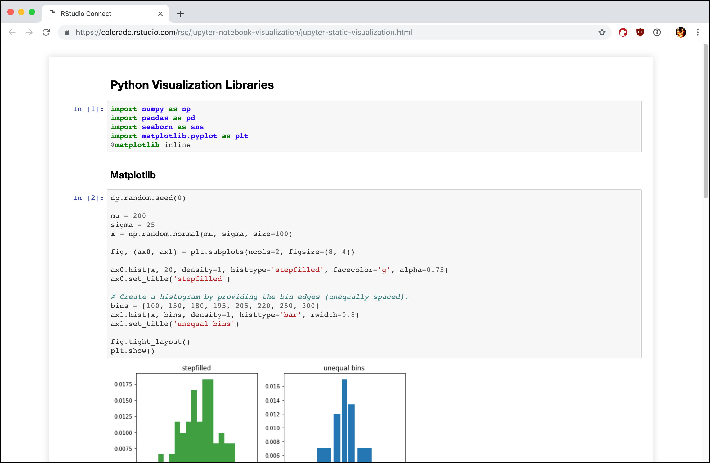
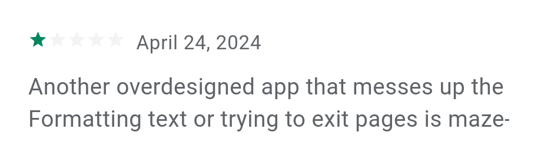
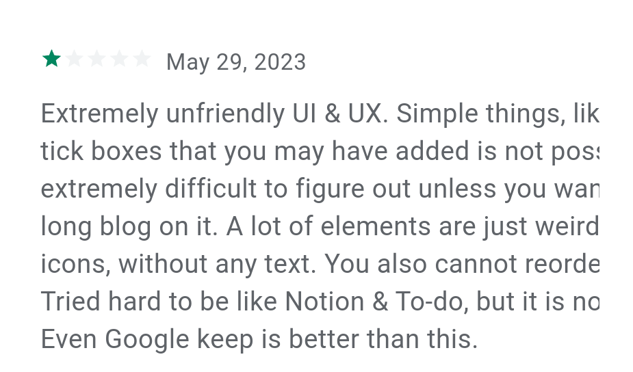
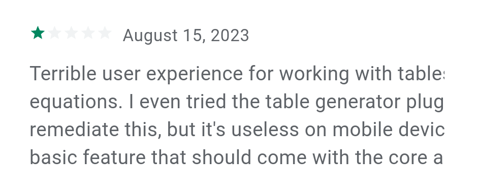

# Why MarkDown is hurting us and probably also you ?

An open letter to the Open source community

(sigh)

There’s so much to say about Markdown.

Why do we keep pretending that Markdown is a universal solution, when it was never designed for that purpose?
So yes, it’s time. It’s time to talk about it.

Markdown, like many trendy technologies, has become incredibly popular.
And yet, for me, it remains a constant source of frustration and confusion.

So, are you ready to take a deep dive into Markdown?
Let’s start from the beginning, what exactly is Markdown?

## 1 - What Is Markdown ?

Markdown is a lightweight text syntax designed to make writing rich text easier.
It lets you create headings, subheadings, lists, tables, and more, all using plain text.

Contrary to what many people think, Markdown is actually quite recent.
The first version of the format appeared only in **2004**.

Before Markdown became ubiquitous, developers mostly relied on **HTML**, as you can still see today in tools like Javadoc, for example.

## 2 - Where Is Markdown Used ?

Markdown is mainly used in two ways.

**First**,
it’s used inside source code repositories, as project documentation, README files, or developer guides.
**Second**,
it’s used for personal note-taking, usually together with dedicated apps such as Obsidian,
Logseq, or one of the countless Markdown-based applications that keep appearing.

Because yes, in the tech world, Markdown is absolutely everywhere.

Some people have even abandoned all other tools to use Markdown exclusively.

Of course, these two use cases often overlap, but it’s still useful to keep this distinction in mind.

## 3 - Why Markdown?
Okay, Markdown is a rich-text syntax, sure. But like many others.

So, between HTML and everything else, what exactly makes Markdown unique ?
And why is it used everywhere, even replacing HTML in some cases?

According to Wikipedia,

“The goal of the language was to enable people to write using an easy-to-read and easy-to-write plain text format.”

At first glance, that may sound perfectly reasonable.
But in reality, this single sentence reveals the two fundamental flaws of Markdown.

**First**
let’s look closely at that goal: “easy to read and to write in plain text.”
This describes a feature, not a purpose.

It tells us what Markdown can do, but not why it should exist.
When you never ask what users actually need, you end up building something that merely does things, instead of something made to solves problems.

**Second**
When we talk about being “easy to read and write in plain text,”
what we’re really saying is that the raw text and the rendered output should look somewhat similar.
If the rendered document looks like a table, then the plain text should also look like a table, built from handwritten ASCII characters.
But as you can guess, plain text isn’t meant for drawing.

It might not be obvious to people used to Markdown,
but these two points are the roots of all the frustration and limitations surrounding it.
From a design perspective, trying to satisfy both humans and machines with the same syntax simply makes no sense.

Even if you tried to imagine a new format that truly met this requirement,

you’d immediately run into massive constraints, Like trying to make a sort of new QR-code , except readable and writable by both machine and human by hand.

As Wintergatan would probably say: that’s a dumb requirement.

Just from that specification alone, you can already predict the result:
a highly limited and frustrating format, and that’s exactly what we ended up with.

## 4 - Markdown as a tool

Okay, despite all its limitations, Markdown is already everywhere.

So maybe, in some cases, it really is the right tool for the job.
To find out, we need to take a closer look at how it actually works, and what it can (and can’t) do.

## 5 - It is a good tool ?

Even if you’ve known about Markdown for years, let’s quickly recap what it can actually do.
With Markdown, you can write titles and subtitles, use bold or italic text, create bullet lists or to-do lists, add links and images, and even make tables, like this:

\|  Column 1      |  Column 2      | 
\| -------------- | -------------- | 
\| Cell 1, Row 1  | Cell 2, Row 1  | 
\| Cell 1, Row 2  | Cell 2, Row 2  | 

But remember, it’s still plain text.

If you edit one cell, you have to manually realign all the lines.
You can’t add multiple rows inside a single cell (in pure Markdown), no rowspan, no colspan, no colors…
Those are basic text features, and you can’t even use most of them. So forget about the rest.

In real life, Markdown tables are so limited that almost nobody writes them by hand anymore.

Instead, people rely on helpers and extensions, like the Markdown WYSIWYG Table Generator ( www.tablesgenerator.com ).

What an irony, wanting to “do everything in text” with no interface, only to end up using a WYSIWYG interface to make it usable.

So yes, Markdown has tables. But are they practical? Not at all.

Outside of tables, Markdown still misses a ton of basic features:
no underlines, no font size or color changes, no way to position elements or add simple diagrams.
And when it comes to more advanced things, like drawing diagrams or integrating visuals, it’s just hopeless.

To be fair, there are a few places where Markdown kind of works.
For example, in code comments.

Although, even there, having clickable diagrams or graphs directly inside the code would be pretty amazing, and surprisingly useful.
But usually, documentation lives elsewhere anyway.

### 5.1 - Fun fact time!

A system that allowed you to combine code, hyperlinks, and diagrams in one place already existed, the DolDoc format from TempleOS.
And yes, as bizarre and religiously themed as that operating system was, it actually had a better code documentation system than most modern tools today.

Among modern software, one popular tool that tried to merge code and documentation is Jupyter Notebook, a web-based platform.

And… well… sigh.
In a world where tons of web WYSIWYG editors already exist, Jupyter has chosen to use Markdown for the text part.

That honestly leaves me speechless.

### 5.2 - In summary

We’ve seen that Markdown’s many limitations come directly from its design.

And that the original design goals are, frankly, hard to justify.

In fact, Markdown is so limited that most platforms extend it with other syntaxes,
like HTML for missing features, and Mermaid or PlantUML to draw diagrams.

## 6 - Mermaid and PlantUml for diagrams ?

Okay, so next, let’s take a quick look at some of the most commonly used Markdown extensions,
starting with Mermaid, which is often used for “drawing” diagrams.

But what exactly is Mermaid?

For those who don’t know, Mermaid originally started as a JavaScript library for rendering schematic diagrams.
It uses yet another custom text-based syntax, which it then renders into visual diagrams.

In most cases, you can embed Mermaid directly inside Markdown, and most Markdown renderers now support it natively.

### 6.1 - So again, is Mermaid actually a good tool ?

We’ve already seen that building rich text on top of a manually editable plain-text syntax was not a great idea.

So what about 2D diagrams ?

“Drawing” with characters was already awkward for formatted text, so for actual diagrams? You can imagine.

Fortunately, Mermaid doesn’t even try to make its raw text look like the final diagram (thankfully).
So the only requirement that remains is “plain text that can be edited by hand.”
But that’s where it becomes even harder to justify.

Because if you’re no longer aiming for visual similarity, and the syntax is just a machine-readable data format,
then why are we still writing it by hand?
It ends up being closer to JSON than Markdown.

So why not just use a proper graphical editor, like draw.io, Inkscape, or even PowerPoint ?

Unsurprisingly, most people who use Mermaid regularly don’t actually write it by hand.

They use web-based tools like Mermaid Live  ( https://mermaid.live/ )which provide, you guessed it, a WYSIWYG interface.

So once again, we’re back to the same irony:
we start by rejecting graphical interfaces to “stay in plain text,” 
only to end up using graphical interfaces again because the syntax is too painful to edit.

Even within those relaxed constraints, the design of Mermaid still leads to big usability issues.

Since users aren’t expected to manually define coordinates,
Mermaid replaces freeform drawing with a series of diagram types, each with its own custom syntax.
That means:
- You must learn a specific syntax for each diagram type.
- If you want to edit or expand a complex diagram, you’ll have to relearn that syntax and hope that what you want to do is possible in this type of diagram.
- And if the kind of diagram you need doesn’t exist, or you want to combine two types, it’s simply not possible.

Meanwhile, with any proper WYSIWYG tool, you can just drag and drop shapes and connect lines, no syntax memorization, less frustration, virtually no limits.

Mermaid can be powerful for automatically generated diagrams, where the source data comes from code or files.

But for handwritten diagrams ? No, Mermaid is not a useful for that.
And, for diagrams made by hand :
- draw.io is a better tool (or excalidraw).
- PowerPoint is also a bettertool .
- SVG + Inkscape are better.
- Almost anything is better for human editing, Despite their respective limitations.

And honestly, we could copy and paste this entire section for PlantUML, the same logic applies.

## 7 - Fun Facs, Alternatives to MarkDown

So far, we’ve gone through quite a few points and dug deep into the fundamental reasons why Markdown just can’t really work well.

But yes, even though Markdown completely dominates today, it’s not alone.

There are, in fact, a few alternative formats that aim for roughly the same goals.

You might not even have heard of them, so let me introduce you to AsciiDoc, reStructuredText, and Textile.

However, as you might expect, all of these syntaxes oscillate between two extremes:
on one side, data-like formats such as HTML, and on the other, ASCII-art-like syntaxes inspired by Markdown.

Sure, some are a bit better than others, but overall, the picture isn’t great.

## 8 - Why MarkDown is everywhere ?

So yes, why is Markdown everywhere?

Especially when we already have far more versatile standards like SVG or HTML?
While that sounds like an interesting question, I actually find it a bit misleading.

So let’s rephrase it. A better question might be:
**As a developer**, why do I see Markdown everywhere?

Because yes, outside the world of development, Markdown is almost completely unknown. And not without reason.

## 9 - MarkDown , it's for developers !

When you develop software, your main output is code.

And every mainstream programming language only understands plain text files.
So your main tool is, naturally, a text editor.

It could have been different, as in Doldoc, where the compiler actually knew where to get the code inside a complex format.
But no. All common languages only handle plain text, and that’s fine.

When your main medium is plain text, it’s no surprise that developers wanted a way to explain and highlight certain parts of the code with comments.

For example, by writing a line like this:

\===================================================

Wanting to standardize this isn’t necessarily a bad idea.
But this idea falls apart when you try to write entire documents in this format.

Because when it comes to documentation, manually editing plain text is no longer a real constraint,
especially since documentation is often completely separate from the code itself.

Developers also face another constraint when it comes to text formats: version control systems like Git.

I won’t go into detail here, but Git doesn’t like non-text files, and for good reasons.

Okay, maybe you do want a text format for your documents.
But that doesn’t mean you need to edit those files manually.

Take Microsoft Word for example.
In fact, a Word document is just a compressed XML file.
If we could use it directly without compression, and with some adaptation, it could theoretically be versioned via Git.

Probably not great, but it shows the huge gap between “pure text” and a proper editor.

And really, how many companies or individuals do you know who don’t rely heavily on office tools?

Also, creating documentation or diagrams is often **many times faster** and more enjoyable with an office suite.

When someone creates a diagram in PowerPoint, it’s simple and easy for **anyone** to maintain.

But when a developer rewrites everything as text, they’re just wasting their time and making future changes slower.
So, in short, they’re completely wrong to do that.
(Especially since merges on these kinds of documents are extremely rare and easy to handle by hand.)

Did you recognize yourself ? Do you feel a little uncomfortable reading this ? More on that later.

## 10  -Markdown as a Base for Note-Taking

Markdown as a Base for Note-Taking

Okay, we’ve now taken a good look at how Markdown is used in a development context.
Now, let’s turn our attention to note-taking systems based on Markdown, such as Obsidian.

Among the reasons often cited in favor of Obsidian, some are indeed very good.
However, many of the most commonly mentioned reasons… are simply not convincing.

(you dont us a not MD note apps ? You can skip to the chapter 12)

### 10.1 - A universal format, future-proof, and without proprietary lock-in !?
#### 10.1.1 - Markdown is never standard

One of the most common arguments for Markdown-based note-taking systems is that they provide a “trusted, future-proof” text format.

The idea is simple: since our notes are in plain text, we should always be able to read and edit them, even if the Markdown application we use disappears.

But here’s the catch: Markdown is never standard.

Take just one example: callouts in Obsidian [obsidian callouts](https://help.obsidian.md/callouts).

Obsidian has a special feature called callouts that lets you highlight or mark text in a visually distinct way.

It’s a nice feature, but it is not part of the official Markdown standard.

So much for “future-proof,” especially when you consider that Obsidian itself is not open source.

And things get even worse when you start looking at Obsidian’s extensions.

#### 10.1.2 - Obsidian’s extensions

In Obsidian (and other Markdown apps), you can extend the functionality with extensions, and there are tons of them available.

Some help you write tables, others add custom features like executable code areas, or integrate external tools such as draw.io.
Some extensions add custom syntaxes directly into the document to make things work.

Others try to stick to the Markdown standard, but don’t always integrate it fully.
It’s important to remember that these extensions are maintained by third parties, and they may stop being supported at any time.

This particularly undermines the sustainability of the ecosystem,
especially since some extensions aren’t compatible with all devices (like Android), or may even change the Markdown syntax itself.

So yes, definitely not future-proof.

Even when you use standard-compliant extensions, for example, ones that help you write tables,
the experience is still generally poor compared to a real WYSIWYG table editor.

Another common argument is:
“I keep my data locally on my devices, without relying on the cloud.”

But once again, this is not without problems. SD cards and hard drives are fragile; they can be lost or damaged.

If you place so much importance on your notes that you sometimes call them your “second brain,” synchronization becomes essential.

#### 10.1.3 - Data synchronization

Let’s get straight to the point: in Obsidian, official synchronization requires a monthly payment and is centralized.

So if you take this seriously, it’s not free, and it’s indeed a form of lock-in to a proprietary system.

Of course, these are just files, so could we use an external tool instead?
Short answer: not really.

On Android, Obsidian still **does not** support cloud apps such as Google Drive.

Of course, they have no interest in developing it, especially because managing native Android functions like the « Content Provider / Storage Access Framework » in Electron is not trivial.
[obsidian SAF](https://forum.obsidian.md/t/android-integration-on-content-provider-api/90278)

As for other external synchronization tools, like Syncthing,
the combination of Android’s disk access restrictions means that Syncthing and Obsidian cannot read and write to the same folders at least using a sd card [Appendix 1](#appendix-1).

Yes, it might be technically feasible by adding an extra layer, but at this stage, is it worth it? Probably not.

Not to mention that this kind of setup is not only painful to configure, but also **extremely user-unfriendly.**

#### 10.1.4 - Is Lock-in a real problem ?

Finally, let’s put this into perspective: is it really so critical to avoid proprietary lock-in at all costs ?

First, it’s important to remember that no data format has ever been permanent.
Formats evolve, whether for images, music, office documents, or others.
Some eventually become obsolete and are replaced.

Even if we consider plain text as a base format, it doesn’t change the reality: Markdown itself only dates back to 2004.

Seeking a more durable and open format can certainly extend the lifespan of your data, but as we’ve seen, this is not really true for Obsidian.

So what? Do we give up everything? No, of course not. There’s one key question to ask:

If the services linked to my note-taking system shut down tomorrow, would I still be able to open my notes and transfer them to another system ?
If the answer is no, it’s probably best to avoid that system entirely.

Fortunately, this is not the case for Obsidian, but it’s also true for MS Word, CherryTree, or any other offline file editor.
In this respect, there’s nothing inherently special about Markdown, except that it is particularly unergonomic and not user-friendly.

And this brings us perfectly to the next topic: user-friendliness and smartphone usage.

### 10.2 - User-friendliness and smartphone

Assessing whether a system is user-friendly is always complex.
There’s a good reason why, in UX processes, prototypes are normally tested with real users.

However, there are still two obvious issues if we remember that we are developers.
First: special characters.

#### 10.2.1 - special chars
As developers, we quickly learn to type a wide range of special characters.
We instinctively know where to find symbols like hashes (#), curly braces ({}), or square brackets ([]) on a keyboard.

For a new user, however, there’s an additional challenge: they must also learn how to type these characters.
And you can bet that many will give up as soon as they encounter Markdown’s limitations.

The problem becomes even worse on smartphones and touch keyboards, where typing these characters is enven less intuitive and ergonomic.
Finally, another critical issue for user-friendliness is this: Markdown is never WYSIWYG.

#### 10.2.2 - MarkDown is never wysiwig

I’ve heard people claim that Obsidian is WYSIWYG, but that’s not true.

There seems to be some confusion about what WYSIWYG actually means.
WYSIWYG stands for “What You See Is What You Get” and refers to software that allows content to be edited visually in a form that closely matches (or is identical to) the final displayed output.

Despite the claims of some applications, when using Markdown, you almost always edit the source code, not the rendered text.

Editing source code for a document is particularly confusing and unusual for average users.

As we’ve seen, not only is this unnecessary, but it’s also strange to mix the backend (source) and frontend (rendered) in software,
especially when there’s no need to directly access the storage format.

To conclude, despite the hype around Obsidian and the popularity of Markdown, it is far from user-friendly.

So, if you want to create a documentation and note-taking app that is:
- Easy to use,
- Lightweight for any device (not web-based),
- Accessible with minimal knowledge,
- Available to the widest range of people,

then you should not use Markdown at all

## 11 - The MarkDown trend, apps, and the opportunity cost

If you’re even slightly curious about note-taking apps,
you’ve probably noticed the insane amount of Markdown-based apps that have been created:

Obsidian, Joplin, Logseq, Standard Notes, Zettlr, SimpleMarkdown, Tangent Note, Noteless, LogSeq, Dendron, SiYuan, Foam, Cuby Text, QOwnNotes, SilverBullet, Noteup, Otterwiki, Reor, Rucola, and probably many others I’m not aware of.

How can we explain such relentlessness, such an enormous amount of work put into developing yet another Markdown app that will supposedly do things “the right way”?
Has anyone ever asked whether Markdown itself is really a good base?

And above all, what a waste of time and effort!

In the book How Big Things Get Done by Bent Flyvbjerg and Dan Gardner, the authors discuss the notion of opportunity cost.
Imagine what could have been accomplished if all this effort had been spent on more impactful or useful projects!

### 11.1 – To Summarise
When considering note-taking apps, we have:
1. Big, easy-to-use commercial applications that can be understood simply by exploring the interface.
2. Apps based on Markdown, which require the average user to:
  - Learn Markdown syntax,
  - Type unusual characters,
  - Learn HTML and other formats…

All this effort ends in limitations and frustration everywhere.

Do you really think the **average** user can, or will, use a Markdown-based note app ?

The answer is simple: no, they won’t.

## 12 - The dark side of the developer

You’ve made it this far, well done! Sincerely, it’s a great sign that you want to face issues head-on and improve.

But why is questioning Markdown so controversial, generating so much engagement when it clearly shouldn’t?

Why is it a subject so sensitive that it may even make some people uncomfortable about their past choices ?

The answer lies in human psychology and culture: tools are tools, and it should be perfectly healthy to discuss and critique them freely.

However, it seems that Markdown has become an untouchable value.

But what value are we really talking about ? 
The value of Markdown itself ? 
well no value in general.

What if Markdown has become a dogma ?
When you don’t use Markdown, people don’t just judge your tools, 
they judge you, based on the tools you use.

In extreme cases, people will even discredit statements based on the tools used:
- “Look, they’re still using Word, the losers.”
- “Lmao, he said my tools seemed complicated, ignorant!”

In reality, this is a form of elitism and dogmatism, a subtle kind of discrimination that often goes unnoticed.

## 13 – When dogmatism discredits and marginalizes the dev Ecosystem
One problem with this dogmatism is that the community tends to close in on itself.
When an average user asks a friend who is highly knowledgeable about computers for advice on note-taking, the answer is often simply: “Markdown.”
Not only is this answer inappropriate for most users, but it also contributes to further marginalizing developers, and, by extension, the broader open source universe.

## 14 – What to Do Next? Do We Need New Standards ?

Before wrapping up this discussion, it’s essential to talk about solutions.
Beyond MarkDown, a huge problem is the lack of a flexible and open standard.

Despite their success, open‑source “standards” are rarely decided collectively.
In practice, they’re imposed by individuals or by the inertia of popular platforms.

Unfortunately, Markdown is now everywhere, it’s hard‑coded into GitLab, GitHub, and countless other tools.

If we wanted to experiment with richer formats, using iframes, embedded scripts, or new syntaxes, these are blocked by “XSS security” rules.

That’s a huge obstacle for experimentation and tool development.
And in environments where every line of code is reviewed, this security argument feels very weak.

We could imagine smarter rules, for example, allowing scripts and links when they come from the repository itself.
Solutions exist. But right now, the ecosystem is not healthy enough to allow innovation easily.

To build better things, we’ll need to define standards designed in a way that’s compatible with the open‑source workflow:
- Reasonably asynchronous,
- Democratic,
- Open to experimentation.
- Expandable

The day we figure out how to do this, the the free software world, will be unstoppable.

Until then:
- If you want to build a great note‑taking app, experiment with formats.
- If you like Markdown, fine. Use it.

But **do not impose** its restrictions on others, and don’t promote a system that won’t suit the majority of users.

## 15 - Become a better you to make us better

Conclusion : Don’t Let Markdown Define You
- Stay open‑minded → don’t be dogmatic about tools.
- Stop promoting Markdown AND plain text format→ They are tools, not the tool. // For the vast majority of people, they are not a good tool.
- Push back wherever **it makes sense** → use better formats when MD limits you.
- Stop purism and elistism → don’t discriminate against people who avoid text‑only tools, maybe they're right.
- Support experimentation → encourage those who try new ways of documenting.
- Hack the platforms → GitHub, GitLab, VSCode: stop blocking innovation with unnecessary restrictions (iframes, scripts).
- Consider user needs rather than a form of ideological purity
- Stop creating new MD applications thinking that this will be “the right way” to proceed, because it won't be. Instead, define what are the gloals and what problems it will solve.

And above all:
- There’s no “right” or “wrong” way to code : only solutions that work better than others.
- Rules exist, but sometimes the smartest thing you can do is break them.
- Take the standards and best practices as a guide for creating your own rules, not as absolute dogma.
- Ask yourself: does my method and my tools serve the goal, or am I serving the method?

If this resonates with you, please share, adapt, argue, improve...
The goal is not to kill Markdown, but to make space for better tools and better thinking.

And please, make this space more welcoming and friendly for you and for everyone else

To be gentle, to be kind, This is the way (Rest now, little Wolf by Vylet pony)

## Appendix 1

On android with sd card , syncthing can only write  to /Adroid/media or /Android/data [ref](https://github.com/Catfriend1/syncthing-android/blob/main/wiki/known-bug-workarounds/All-files-access_SD-card-write-access.md)

and talking about user-friendliness.

on pc The only native interface is syncthin gtk, which is no longer maintained and often lacks information from the web interface.
So if we don't recommend st gtk, does that mean launching it via the command line?

As for the phone, are there two interfaces, the web and the native? Plus managing settings like ignoring permissions and other things. 
It's definitely not for the average user.

(Not to mention the inotify handle limit for very large directories, which requires root access on android) [ref](https://docs.syncthing.net/users/faq.html#how-do-i-increase-the-inotify-limit-to-get-my-filesystem-watcher-to-work)

I like Syncthing and use it 24/7, but that's not a reason.

